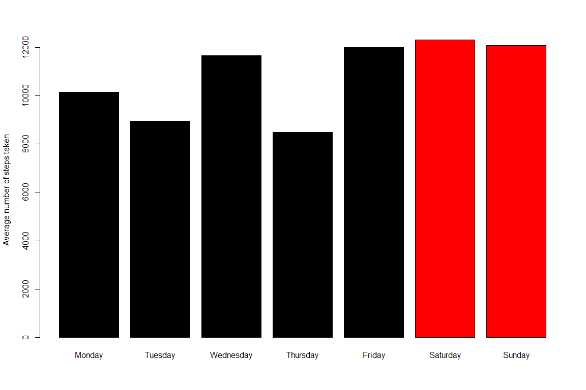

  
  
## Load the data and preprocess it.
  
* Unzip the zip file if it is needed.
* Read csv and convert data column to Date type.


```r
if(!file.exists("activity.csv")){
  unzip("activity.zip")
}
  activityTable <-read.csv("activity.csv",sep = ',')
  activityTable$date <- as.Date(activityTable$date)
```


## What is mean total number of steps taken per day?
  
* Find total steps per day with aggregate function.
* Plot a histogram of total steps per day.
  


```r
sumTable <- aggregate(steps ~ date,na.exclude( activityTable),FUN=sum)
stepVec <- sumTable$steps
hist(stepVec,xlab = "Total steps on a day",main="Histogram of total steps per day",col = "blue")
```

<!-- -->

***

Calculate *mean* and *average* of total steps per day.
  

```r
mean(stepVec,na.rm = TRUE)
```

```
## [1] 10766.19
```

```r
median(stepVec,na.rm = TRUE)
```

```
## [1] 10765
```
  

***

 
## What is the average daily activity pattern?
  
* Calculate the mean of average number of steps taken in each interval across all days.
* Draw a line plot of intervals and number of average steps taken in that interval.


```r
meanTable <- aggregate(steps ~ interval, activityTable, FUN=mean)
plot(x=meanTable$interval,y=meanTable$steps,xlab = "Interval", ylab= "Average total steps",type="l")
```

<!-- -->
  
  
  
Find the time interval with the greatest average number of steps.

```r
maxInterval <-meanTable[which.max(meanTable$steps),1]
maxInterval
```

```
## [1] 835
```

This time interval corresponds to 08:35 - 08:40   


## Imputing missing values

Calculate total number of NA values.


```r
sum(is.na(activityTable))
```

```
## [1] 2304
```
  
Apparently, there are many missing values in the data. To continue the analysis, a solution strategy is needed.

```r
naSubset <- activityTable[which(is.na(activityTable[,1])),]
table(naSubset$date)
```

```
## 
## 2012-10-01 2012-10-08 2012-11-01 2012-11-04 2012-11-09 2012-11-10 2012-11-14 2012-11-30 
##        288        288        288        288        288        288        288        288
```
There is no data from 8 days and the other days don't have any missing values.
Replace each NA value with the mean number of steps taken in its interval.

```r
completeTable <- activityTable
completeTable[which(is.na(activityTable[,1])),1] <- rep(meanTable[,2],8)
```
  
  
Check the mean of total number of steps taken per day after missing values are imputed.   


```r
sumTable <- aggregate(steps ~ date, completeTable, FUN=sum)
stepVec <- sumTable$steps
hist(stepVec,xlab = "Total steps on a day",main="Histogram of total steps per day",col = "red")
```

<!-- -->

The increase in frequency of days with 10000-15000 steps is evident. It is because missing values are imputed with the mean values.

***

## Are there differences in activity patterns between weekdays and weekends?
  
  * Find mean total number of steps taken corresponding to each day of the week.
  * Sort the table according to order of days.
  * Create a factor identifying weekdays and weekends.


```r
meanDays <- aggregate(steps ~ weekdays(sumTable$date), sumTable , FUN= mean)
colnames(meanDays) <- c("weekday","steps")
dayNames <-c( "Monday", "Tuesday", "Wednesday", "Thursday", "Friday", "Saturday","Sunday")

meanDays$weekday <- factor(meanDays$weekday, levels=dayNames )
meanDays <- meanDays[order(meanDays$weekday),]

weekDayLabel <- c(rep("Weekday",5),rep("Weekend",2))
meanDays$dayFactor <- weekDayLabel
```


Draw a barplot of days and mean number of total steps taken on each day. 


```r
barplot( names.arg =dayNames,height=meanDays$steps,col =factor(meanDays$dayFactor),ylab = "Average number of steps taken")  
```

<!-- -->

Evidently, people take more steps at weekends.
